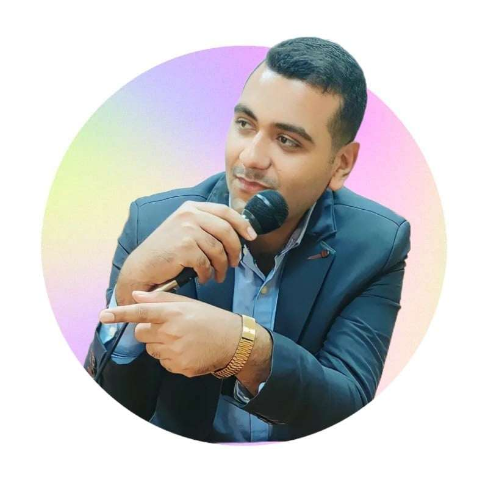

[[السيرة الذاتية باللغة العربية  Resume in Arabic](cv-arabic.jpg)]

# Abdelwahab M. Khidr  
**English Instructor | Legal Translator & Copywriter**  
- **Email:** [Abdelwahabkhidr1997@gmail.com](mailto:Abdelwahabkhidr1997@gmail.com)  
- **Phone:** [0201092943953](https://wa.me/201092943953)
- [LinkedIn Profile](https://www.linkedin.com/in/abdelwahab-khidr-207a53298?utm_source=share&utm_campaign=share_via&utm_content=profile&utm_medium=android_app)
- **Comprehensive Portfolio:** [Hosted on Google Drive for Secure Access](https://drive.google.com/drive/folders/1TP_-6YoHBv9c-Kap2IfASU5GA80PY3uT?usp=sharing)
- **Location:** Egypt

## Experience  

### Translation  
- Two years of experience translating various content types, including legal documents (Arabic-English) and vice versa, films, and advertisements. Ensuring accuracy, cultural relevance, and adherence to client guidelines.  
**(2022-2023)**

### Academic Researcher and Copywriter  
- Three years of experience writing and analyzing academic reports and advertising.  
- Applied new linguistic techniques in report writing and research projects.  
- Developed research, analysis, and in-depth report writing skills in literary linguistics and English literature.  
**(2022-2024)**

### Private English Language Teacher  
- Seven years of experience teaching English to a wide range of students.  
- Developed and delivered customized lesson plans tailored to each student's needs.  
- Provided one-on-one lessons to improve English language proficiency.  
**(2018-2024)**

### Army Financial and Administrative Affairs  
- One year of experience in financial and administrative affairs in the Egyptian Armed Forces, ensuring accuracy and adherence to military financial protocols.  
**(2022)**

---

## Education  

### Faculty of Arts, English Department  
- **Bachelor of Arts:** English Language Department  
  *2018-2021*  
- **Pre-master:**  
  *2021-2023*  
- **Master in Linguistics and Hybrid Translation:**  
  *2023-2024*  

### Research Projects  
- Completed more than 20 mini-research projects in linguistics and English literature.  
**(2021-2024)**

---

## Certifications  
- **FDTC (Fundamentals of Digital Transformation):** Microsoft Office programs, networking, and mobile applications.  
- **Digital Services certification:** Facilitating the digital life of students and researchers.
- **Certificate of Distinguished Quality from the Faculty of Arts, Kafrelsheikh University**  
- **Certificate from Egypt's Minister of Defense, General Muhammad Zaki:** Commander-in-Chief of the Armed Forces and Minister of Defense and Military Production.

---

## Skills  
- Proficient in CAT tools, Subtitle Editors, Video Editors, and AI models.
